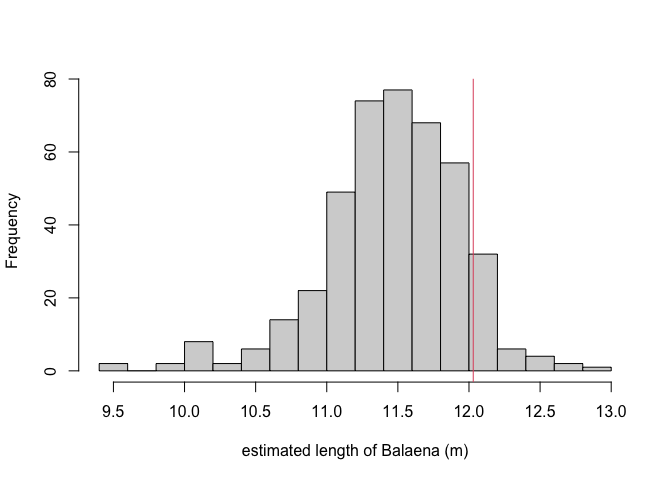

## Callibration data

This Dataset has 426 images of Balaena taken during different flights
and dates. \* altitudeRaw: the altitude indicated by DJI (zeroed at
takeoff).

-   imageWidth: picture’s width in pixels (1920 or 3840).

-   pixel.length: Balaena’s length in pixels.

-   position: whether Balaena was in the center of the frame (pos\_c) or
    closer to the edges (pos\_o).

<!-- -->

    head(dat)

    ##         Date FlightNo                          imageName timeStamp altitudeRaw
    ## 1 2023-04-08      198 DJI_0005.MP4_00_00_02_vlc00001.png      0:02        50.4
    ## 2 2023-04-08      198 DJI_0005.MP4_00_00_04_vlc00002.png      0:04        49.7
    ## 3 2023-04-08      199 DJI_0006.MP4_00_03_03_vlc00001.png      3:03       119.4
    ## 4 2023-04-08      199 DJI_0006.MP4_00_03_11_vlc00002.png      3:11       120.1
    ## 5 2023-04-08      199 DJI_0006.MP4_00_03_14_vlc00003.png      3:14       120.3
    ## 6 2023-04-08      199 DJI_0006.MP4_00_03_16_vlc00004.png      3:16       119.7
    ##   imageWidth pixel.length position
    ## 1       3840     654.6037    pos_c
    ## 2       3840     672.1734    pos_c
    ## 3       3840     282.6148    pos_o
    ## 4       3840     282.4793    pos_o
    ## 5       3840     283.7345    pos_o
    ## 6       3840     287.1069    pos_o

## Correct initial altitude

The drone altitude is zeroed the moment the rotors start, which means
that the true altitude needs to add the distance from the drone’s launch
point to the water:

 \*note that, in Balaena’s
case, the altitude we want is the distance from the drone to the boat,
so we can omit the boat height in the calculation as follows:

    #recalculate Balaena's length in m, with new altitude 
    boat.height = 1.03- 0.24# balaena's altitude over the water - toe rail

    launch.chest = 1.4 # Mateo's chest height
    camera.height = 0.045 # cameras distance above the base of the drone's legsfrom legs

    dat$altitude.fix <- dat$altitude + launch.chest + camera.height
    head(dat)

    ##         Date FlightNo                          imageName timeStamp altitudeRaw
    ## 1 2023-04-08      198 DJI_0005.MP4_00_00_02_vlc00001.png      0:02        50.4
    ## 2 2023-04-08      198 DJI_0005.MP4_00_00_04_vlc00002.png      0:04        49.7
    ## 3 2023-04-08      199 DJI_0006.MP4_00_03_03_vlc00001.png      3:03       119.4
    ## 4 2023-04-08      199 DJI_0006.MP4_00_03_11_vlc00002.png      3:11       120.1
    ## 5 2023-04-08      199 DJI_0006.MP4_00_03_14_vlc00003.png      3:14       120.3
    ## 6 2023-04-08      199 DJI_0006.MP4_00_03_16_vlc00004.png      3:16       119.7
    ##   imageWidth pixel.length position altitude.fix
    ## 1       3840     654.6037    pos_c       51.845
    ## 2       3840     672.1734    pos_c       51.145
    ## 3       3840     282.6148    pos_o      120.845
    ## 4       3840     282.4793    pos_o      121.545
    ## 5       3840     283.7345    pos_o      121.745
    ## 6       3840     287.1069    pos_o      121.145

Next, we use the following formula to calculate Balaena’s length
according to the drone’s data: length = (alpha/image.width) \* altitude
\* length.pixels

$ length = true.altitude pixel.length $

Where *alpha* is the camera’s correction factor, estimated in the lab by
measuring objects of known length and distance. This equation is
reflected in the following function:

    morpho.length.alpha <- function(alpha = 1.2646,image.width, altitude, length.pixels){
      length = (alpha/image.width) * altitude * length.pixels
    }

This results in the following estimated length for Balaena:

    dat$bal.length<- morpho.length.alpha(altitude = dat$altitude.fix,
                                          image.width = dat$imageWidth,
                                          length.pixels = dat$pixel.length)
    summary(dat$bal.length)

    ##    Min. 1st Qu.  Median    Mean 3rd Qu.    Max. 
    ##   9.457  11.212  11.493  11.458  11.754  12.966

    hist(dat$bal.length, breaks = 20, xlab = "estimated length of Balaena (m)", main = "")
    abline(v = 12.03, col = 2)

<figure>

<figcaption aria-hidden="true">Histogram of Balaena’s length estimated
using the DJI Mini Drone. The red line shows Balaena’s True
length</figcaption>
</figure>
