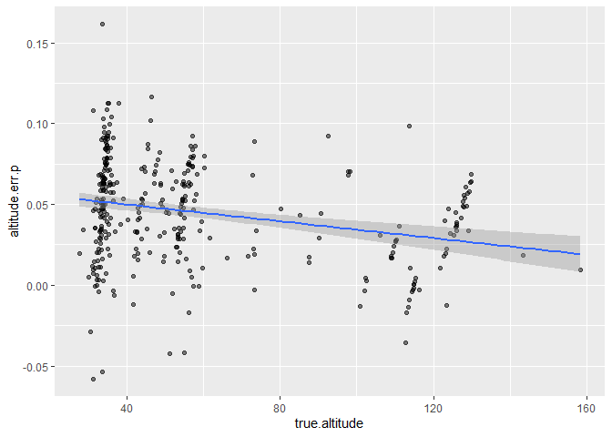

## Callibration data

This Dataset has 343 images of Balaena (at nadir) taken during different
flights and dates.

-   altitudeRaw: the altitude indicated by DJI (zeroed at takeoff).

-   imageWidth: picture’s width in pixels (1920 or 3840).

-   pixel.length: Balaena’s length in pixels.

-   position: whether Balaena was in the center of the frame (pos\_c) or
    closer to the edges (pos\_o).

-   nadir: confirms that the the gimbal pitch during the screenshot was
    &lt;- 87 degrees (i.e., close to perpendicular)

<!-- -->

    head(dat)

    ##         Date FlightNo                          imageName timeStamp altitudeRaw
    ## 1 2023-04-08      198 DJI_0005.MP4_00_00_02_vlc00001.png      0:02        50.4
    ## 2 2023-04-08      198 DJI_0005.MP4_00_00_04_vlc00002.png      0:04        49.7
    ## 3 2023-04-08      199 DJI_0006.MP4_00_03_03_vlc00001.png      3:03       119.4
    ## 4 2023-04-08      199 DJI_0006.MP4_00_03_11_vlc00002.png      3:11       120.1
    ## 5 2023-04-08      199 DJI_0006.MP4_00_03_14_vlc00003.png      3:14       120.3
    ## 6 2023-04-08      199 DJI_0006.MP4_00_03_16_vlc00004.png      3:16       119.7
    ##   imageWidth pixel.length position nadir
    ## 1       3840     654.6037    pos_c  TRUE
    ## 2       3840     672.1734    pos_c  TRUE
    ## 3       3840     282.6148    pos_o  TRUE
    ## 4       3840     282.4793    pos_o  TRUE
    ## 5       3840     283.7345    pos_o  TRUE
    ## 6       3840     287.1069    pos_o  TRUE

## Correct initial altitude

The drone altitude is zeroed the moment the rotors start, which means
that the true altitude needs to add the distance from the drone’s launch
point to the water:

<figure>

<figcaption aria-hidden="true">depiction of how the true altitude from
the water line is calculated</figcaption>
</figure>

*Note that, in Balaena’s case, the altitude we want is the distance from
the drone to the boat, so we can omit the boat height in the calculation
as follows:*

    #recalculate Balaena's length in m, with new altitude 
    boat.height = 1.03- 0.24# balaena's altitude over the water - toe rail

    launch.chest = 1.4 # Mateo's chest height
    camera.height = 0.045 # cameras distance above the base of the drone's legsfrom legs

    dat$altitude.fix <- dat$altitude + launch.chest + camera.height
    head(dat)

    ##         Date FlightNo                          imageName timeStamp altitudeRaw
    ## 1 2023-04-08      198 DJI_0005.MP4_00_00_02_vlc00001.png      0:02        50.4
    ## 2 2023-04-08      198 DJI_0005.MP4_00_00_04_vlc00002.png      0:04        49.7
    ## 3 2023-04-08      199 DJI_0006.MP4_00_03_03_vlc00001.png      3:03       119.4
    ## 4 2023-04-08      199 DJI_0006.MP4_00_03_11_vlc00002.png      3:11       120.1
    ## 5 2023-04-08      199 DJI_0006.MP4_00_03_14_vlc00003.png      3:14       120.3
    ## 6 2023-04-08      199 DJI_0006.MP4_00_03_16_vlc00004.png      3:16       119.7
    ##   imageWidth pixel.length position nadir altitude.fix
    ## 1       3840     654.6037    pos_c  TRUE       51.845
    ## 2       3840     672.1734    pos_c  TRUE       51.145
    ## 3       3840     282.6148    pos_o  TRUE      120.845
    ## 4       3840     282.4793    pos_o  TRUE      121.545
    ## 5       3840     283.7345    pos_o  TRUE      121.745
    ## 6       3840     287.1069    pos_o  TRUE      121.145

Next, we use the following formula to calculate Balaena’s length
according to the drone’s data:

*l**e**n**g**t**h* = alpha × true altitude × pixel length

Where *alpha* is the camera’s correction factor, estimated empirically
in the lab by measuring objects of known length and distance. For the
DJI Mini, *alpha* = 0.000328 at 3840, and *alpha* = 0.000656 at 1920
This equation is reflected in the following function:

    morpho.length.alpha <- function(image.width, altitude, length.pixels){
      alpha = ifelse(image.width == 3840, yes = 0.000328, no = 
                       ifelse(image.width == 1920, yes = 0.000656, no = NA))
      length = alpha * altitude * length.pixels
      return(length)
    }

This results in the following estimated length for Balaena:

    dat$bal.length<- morpho.length.alpha(altitude = dat$altitude.fix,
                                          image.width = dat$imageWidth,
                                          length.pixels = dat$pixel.length)
    summary(dat$bal.length)

    ##    Min. 1st Qu.  Median    Mean 3rd Qu.    Max. 
    ##   10.09   11.21   11.46   11.48   11.75   12.73

    hist(dat$bal.length, breaks = 20, xlab = "estimated length of Balaena (m)", main = "")
    abline(v = 12.03, col = 2, lwd = 2)

<figure>

<figcaption aria-hidden="true">Histogram of Balaena’s length estimated
using the DJI Mini Drone. The red line shows Balaena’s True
length</figcaption>
</figure>

This means there is an under-estimate of Balaena’s length of mean = 0.55
, and s.d. = 0.38

    dat$error <- dat$bal.length-12.03
    mean(dat$error)

    ## [1] -0.546828

    sd(dat$error)

    ## [1] 0.3796155

The following section models the error induced by inaccurate altitude
measurements based on Burnett et al., 2018.

## Questions

-   Where should the correction factor go - is it a constant that I add
    to the total, or is it specifically for the altitude?

## Altitude experiment:

Here, I will attempt to mitigate and measure of the error comes from bad
altitude estimates. So I used our knowledge of Balaena’s true length,
assumed all other measurements were adequate, and calculated **true
altitude**, and found that the good altitudes are further away from the
measured altitudes at higher altitudes. For this, I used the formula:

$$
true.altitude = \frac{true.length}{pixel.length}  \times alpha
$$

    true.altitude <- function(true.length, pixel.length, image.width){
      alpha = ifelse(image.width == 3840, yes = 0.000328, no = 
                       ifelse(image.width == 1920, yes = 0.000656, no = NA))
      t.a = (true.length/(pixel.length* alpha))
      return(t.a)
    }

    dat$true.altitude <- true.altitude(true.length = 12.03, 
                                       pixel.length = dat$pixel.length, 
                                       image.width = dat$imageWidth)

Next, I estimated the altitude error as a raw value and a percentage:

    dat$altitude.err <- dat$true.altitude - dat$altitude.fix
    dat$altitude.err.p <- (dat$altitude.err/dat$true.altitude)

Which results in the following error distribution for the altitude in m:

    hist(dat$altitude.err, breaks = 30, xlab = "altitude error (m)", 
         main = "")

    text(x = 10, y = 40, paste("mean error = ",signif(mean(dat$altitude.err), digits =3)))

    text(x = 10, y = 35, paste("s.d. = ",signif(sd(dat$altitude.err), digits =3)))

How does this look across altitudes?

    ggplot(dat, aes(x = altitude.fix, y = true.altitude))+
      geom_point(alpha = 0.5)+
      theme(legend.position = "none")+ 
      geom_smooth(method = "lm")

    ## `geom_smooth()` using formula = 'y ~ x'

Can I model true altitude based on barometric altitude?

    # model random intercept :
    library(nlme)

    ## 
    ## Attaching package: 'nlme'

    ## The following object is masked from 'package:dplyr':
    ## 
    ##     collapse

    # should it be hierarchical?
    m.int <- gls(true.altitude ~ altitude.fix, data = dat, method = "ML")
    summary(m.int) #AIC = 1405.26/ BIC = 1416.77    

    ## Generalized least squares fit by maximum likelihood
    ##   Model: true.altitude ~ altitude.fix 
    ##   Data: dat 
    ##       AIC      BIC    logLik
    ##   1405.26 1416.774 -699.6302
    ## 
    ## Coefficients:
    ##                 Value  Std.Error   t-value p-value
    ## (Intercept)  1.403227 0.20573563   6.82054       0
    ## altitude.fix 1.017178 0.00326498 311.54199       0
    ## 
    ##  Correlation: 
    ##              (Intr)
    ## altitude.fix -0.872
    ## 
    ## Standardized residuals:
    ##         Min          Q1         Med          Q3         Max 
    ## -3.97545314 -0.55486561  0.03380869  0.58140085  4.31252602 
    ## 
    ## Residual standard error: 1.860415 
    ## Degrees of freedom: 343 total; 341 residual

    intervals(m.int, level = 0.9)

    ## Approximate 90% confidence intervals
    ## 
    ##  Coefficients:
    ##                 lower     est.    upper
    ## (Intercept)  1.063900 1.403227 1.742554
    ## altitude.fix 1.011793 1.017178 1.022563
    ## 
    ##  Residual standard error:
    ##    lower     est.    upper 
    ## 1.751039 1.860415 1.985693

    # model random intercept :
    m.rand <- lme(true.altitude ~ altitude.fix, data = dat, method = "ML",
                  random = ~1|Date)# 
    summary(m.rand) # AIC = 1389.933 BIC = 1405.284 - probably yes?

    ## Linear mixed-effects model fit by maximum likelihood
    ##   Data: dat 
    ##        AIC      BIC    logLik
    ##   1389.933 1405.284 -690.9664
    ## 
    ## Random effects:
    ##  Formula: ~1 | Date
    ##         (Intercept) Residual
    ## StdDev:   0.5822751 1.769358
    ## 
    ## Fixed effects:  true.altitude ~ altitude.fix 
    ##                 Value  Std.Error  DF   t-value p-value
    ## (Intercept)  1.200652 0.27882293 324   4.30615       0
    ## altitude.fix 1.020027 0.00360891 324 282.64151       0
    ##  Correlation: 
    ##              (Intr)
    ## altitude.fix -0.748
    ## 
    ## Standardized Within-Group Residuals:
    ##         Min          Q1         Med          Q3         Max 
    ## -3.93670875 -0.55193758  0.02940306  0.50419569  4.45160196 
    ## 
    ## Number of Observations: 343
    ## Number of Groups: 18

    intervals(m.rand, level = 0.9)

    ## Approximate 90% confidence intervals
    ## 
    ##  Fixed effects:
    ##                 lower     est.    upper
    ## (Intercept)  0.742057 1.200652 1.659247
    ## altitude.fix 1.014091 1.020027 1.025963
    ## 
    ##  Random Effects:
    ##   Level: Date 
    ##                     lower      est.     upper
    ## sd((Intercept)) 0.3597236 0.5822751 0.9425135
    ## 
    ##  Within-group standard error:
    ##    lower     est.    upper 
    ## 1.658987 1.769358 1.887073

    # add altitude:
    m.rand.alt <- lme(altitude.err ~ true.altitude, data = dat, method = "ML",
                  random = ~1|Date)
    anova(m.rand, m.int)# does help!

    ##        Model df      AIC      BIC    logLik   Test  L.Ratio p-value
    ## m.rand     1  4 1389.933 1405.284 -690.9664                        
    ## m.int      2  3 1405.260 1416.774 -699.6302 1 vs 2 17.32749  <.0001

    summary(m.rand.alt)# 1182.965   

    ## Linear mixed-effects model fit by maximum likelihood
    ##   Data: dat 
    ##        AIC     BIC    logLik
    ##   1374.739 1390.09 -683.3694
    ## 
    ## Random effects:
    ##  Formula: ~1 | Date
    ##         (Intercept) Residual
    ## StdDev:   0.6334224 1.724881
    ## 
    ## Fixed effects:  altitude.err ~ true.altitude 
    ##                   Value Std.Error  DF  t-value p-value
    ## (Intercept)   0.8938926 0.2866947 324 3.117925   0.002
    ## true.altitude 0.0242220 0.0034875 324 6.945381   0.000
    ##  Correlation: 
    ##               (Intr)
    ## true.altitude -0.737
    ## 
    ## Standardized Within-Group Residuals:
    ##         Min          Q1         Med          Q3         Max 
    ## -4.05616585 -0.54939958  0.06462783  0.52316612  4.30677559 
    ## 
    ## Number of Observations: 343
    ## Number of Groups: 18

    intervals(m.rand.alt, level = 0.9)

    ## Approximate 90% confidence intervals
    ## 
    ##  Fixed effects:
    ##                    lower       est.      upper
    ## (Intercept)   0.42235036 0.89389259 1.36543482
    ## true.altitude 0.01848596 0.02422204 0.02995813
    ## 
    ##  Random Effects:
    ##   Level: Date 
    ##                     lower      est.    upper
    ## sd((Intercept)) 0.3898258 0.6334224 1.029239
    ## 
    ##  Within-group standard error:
    ##    lower     est.    upper 
    ## 1.616822 1.724881 1.840161

How does **percent** error compare to altitude?

    ggplot(dat, aes(x = true.altitude, y = altitude.err.p))+
      geom_point(alpha = 0.5)+
      theme(legend.position = "none")+ 
      geom_smooth(method = "lm")

    ## `geom_smooth()` using formula = 'y ~ x'

Which looks like error is proportional, more than an added constant

    mean(dat$altitude.err.p)

    ## [1] 0.04545537

    quantile(dat$altitude.err.p, probs = c(0.05, 0.95))

    ##          5%         95% 
    ## -0.00363185  0.09236528

So if I add the result from the gls non.hierarchical model:

    dat$altitude.corr <-1.40 + dat$altitude.fix*1.017

    dat$bal.length.c<- morpho.length.alpha(altitude =dat$altitude.corr,
                                          image.width = dat$imageWidth,
                                          length.pixels = dat$pixel.length)
    quantile(dat$bal.length.c, probs = c(0.05, 0.5, 0.95))

    ##       5%      50%      95% 
    ## 11.50748 12.00834 12.68490

    hist(dat$bal.length.c, breaks = 30, main = "", xlab = "estimated length")
    abline(v = 12.03, col = 2, lwd = 2)

Look at error pre & post correction:

    dat$length.error.c <- dat$bal.length.c - 12.03 # corrected error raw
    dat$length.error.c.p <- (dat$length.error.c/dat$bal.length.c)*100

    dat$length.error.p <- (dat$error/dat$bal.length)*100

    e <- c(dat$length.error.c.p,dat$length.error.p)
    d <- data.frame(perc.error = e, error.type = rep(c("corrected", "uncorrected"), each = length(dat$bal.length)))

    ggplot(d, aes(x = error.type, y = perc.error, color = error.type))+
      geom_boxplot()+
        scale_y_continuous(limits=c(-60,60), breaks = seq(-60,60,10))+
      labs(y = "corrected % error", x = "error type")+
      theme(legend.position = "null")+
      geom_hline(yintercept = 0)+
      geom_hline(yintercept = -5, linetype = "dashed")+
      geom_hline(yintercept = 5, linetype = "dashed")

This looks pretty reasonable!

What is the 95% confidence interval:

    quantile(dat$length.error.c.p, probs=c(0.05, 0.95))

    ##        5%       95% 
    ## -4.540695  5.162811
